# Duplicate Management

## User experience

### Deduplication

Every time when a record is under creation or update, duplicate management service performs a cross-check of the new data input against existing records in the database according to the Duplicate Rules settings. In case at least one duplicate is detected a notification appears with a "Show Duplicates" button.

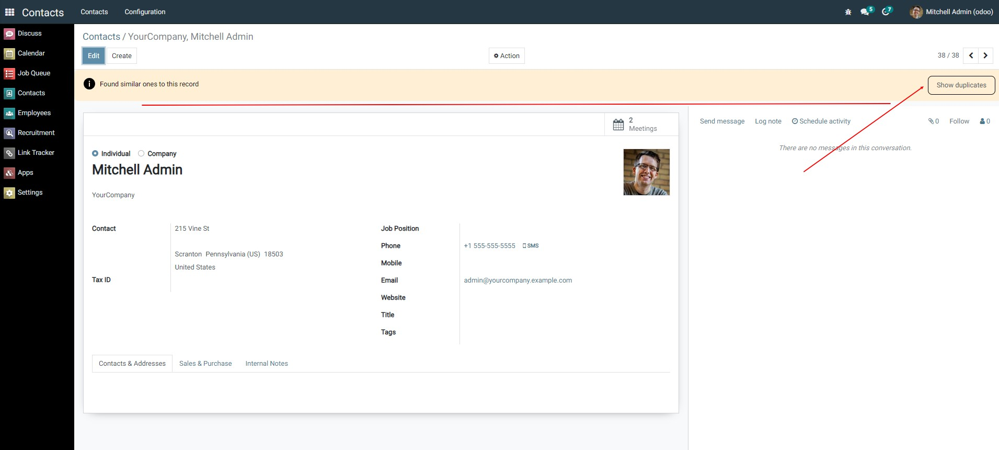

### Merging
The click on "Show Duplicates" button opens the list of all the records considered as duplicates.

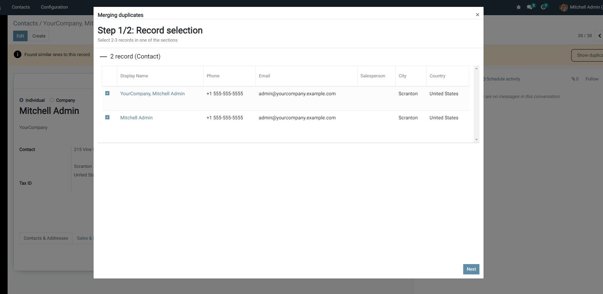

The user may go through all the detected duplicates and mark (in a checkbox) which records should be merged. The system allows to combine up to 3 records at a time. To proceed with the duplicates merge the user needs to click on “Next” button.

On this page the User may choose which values to keep in the final output.
The field names are located on the left side of the screen and the correspondent values from the chosen duplicates are on the right side.
The user defines first which record he/she wants to keep as a basis for the final output (by activating the “Original” indicator) and then the user chooses the values that should be kept in the final record.

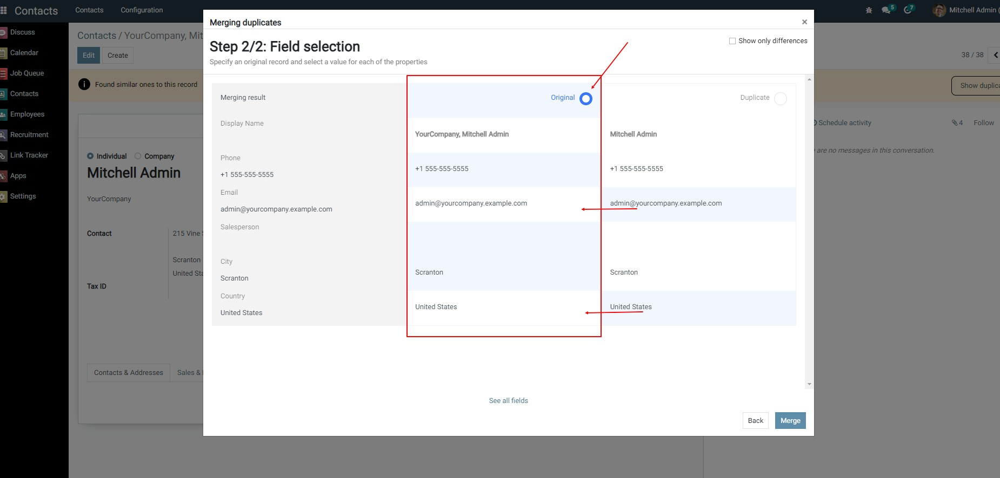

Depending on the rules settings, there may be a 3rd step in which you can inherit attachments from the deleted entry:

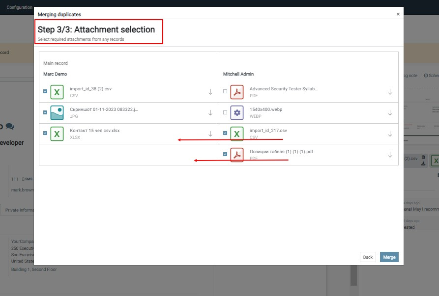

The attachment can be downloaded, viewed and make a decided on its value.
Marked attachments are inherited into the original entry.

After clicking “Merge” button, the main record is updated to inherit the fields, and all other records are archived.

## Administration
In the settings there is a section for administering the "Duplicate Management" functionality
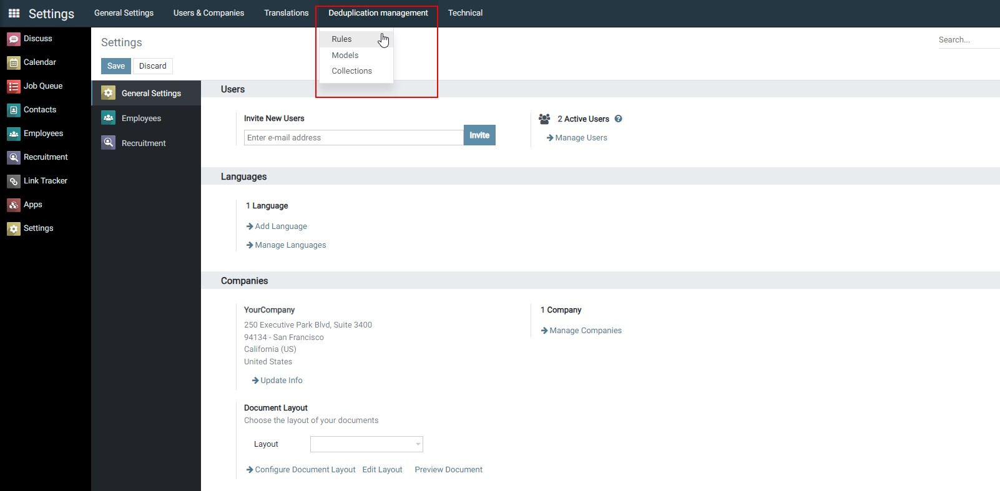

### Duplicate rules

This section stores all the rules for identifying duplicates:
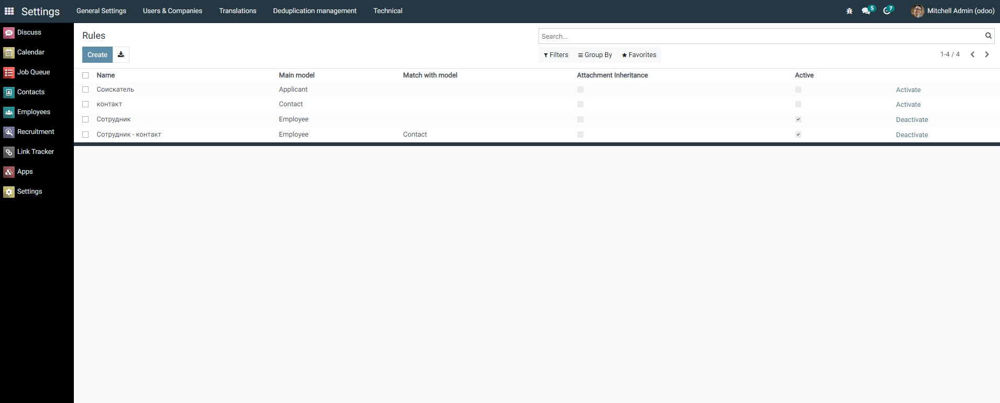

Creating a new rule:
1. You can add a rule by clicking the **Create** button.

2. **Name**. Provide a name for the rule.

3. **Main model**. Indicate which model of your database is used to search for duplicates.

4. **Attachment Inheritance**. Allows users to inherit attachments from deleted posts.

5. **Conditions**. If desired, you can specify the conditions under which records will be excluded from the search for duplicates.
   - a. After adding a new line, specify the exception condition:
   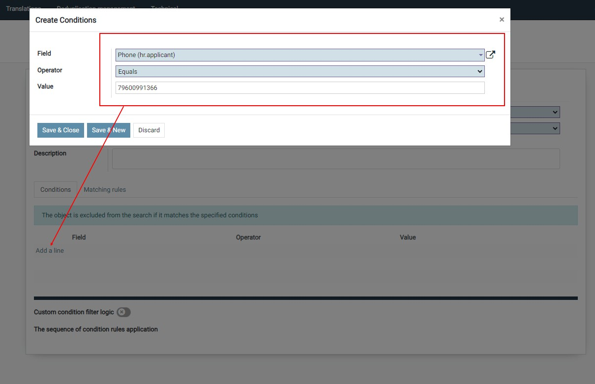

   - b. Add your own exception condition logic.
     The system automatically generates a formula with the AND operator. Activate the “Custom filter logic” switch to set your logic:
   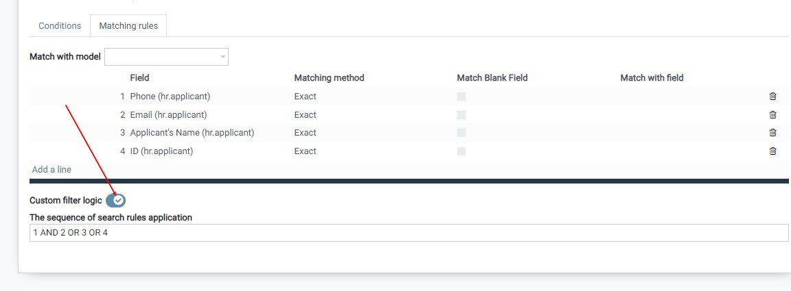

6. **Matching rules**. This section of the settings determines which objects and by which fields we compare records with each other.
   Here you can add multiple rules one at a time, where each line represents a rule to compare against a separate field. You can use your own filter logic to implement any requirement:
   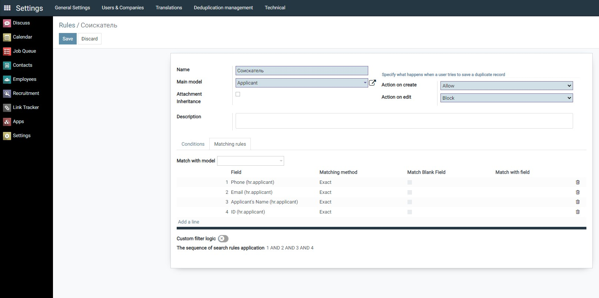

   - a. **Filed**. Select the object field whose match is considered a criterion for identifying duplicates.

   - b. **Match blank fields**. If “Match blank fields” is selected for a field, and that field is blank in both records being compared, then they are considered duplicates.

   - c. **Matching Method**. The matching method determines how a specific field in a record is compared to the same field in another record.
   The exact match method searches for strings that exactly match a pattern. Fuzzy matching methods look for strings that approximately match a pattern.
   The system supports the following fuzzy matching methods:
     - Soundex
     - Levenshtein
     - Metaphone Ru
     - Phone number

   - d. **Match with model**. Don't limit yourself to one model. This functionality will allow you to identify duplicates when records match with other models:
   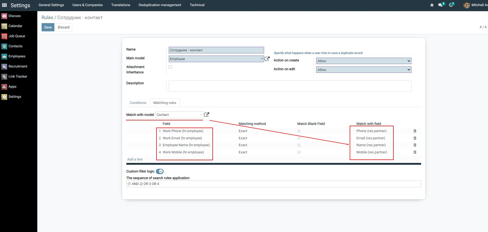

    When a rule is configured in this way, the search is performed both between models and across records within the model A=B | A=A | B=B.

7. You can prevent the creation of duplicates. Select an action when creating a new record and when updating an existing one:
    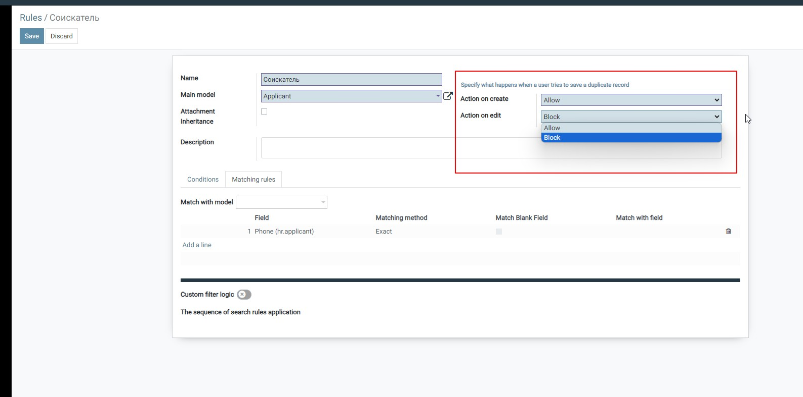
    Our Import module allows you to load only unique records from a file containing duplicates. In this case, unique records will be loaded and duplicates will be skipped. Once the import is complete, a file with the download result will be available. .

8. Activate your rule.
   When all the settings are completed, and you are ready to rid the system of duplicates, click **Activate**:
   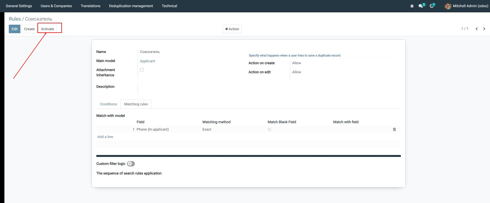

### Duplicate collection
A table that stores information about all takes, such as:
- Duplication rule name
- List of found records
- Date of creation of the collection of duplicates
- Link to post
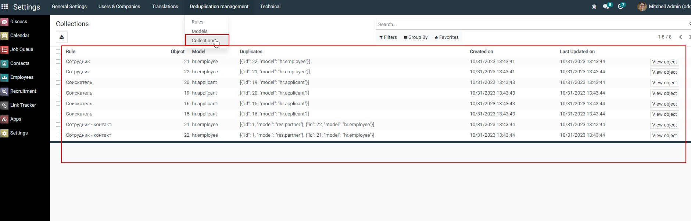

### Import module

The accompanying "Import" module allows you not to worry about duplicates in the downloaded files. Only unique records are loaded. Import shows the status of records
- Pending downloads
- Uploaded
- Not loaded due to an error.
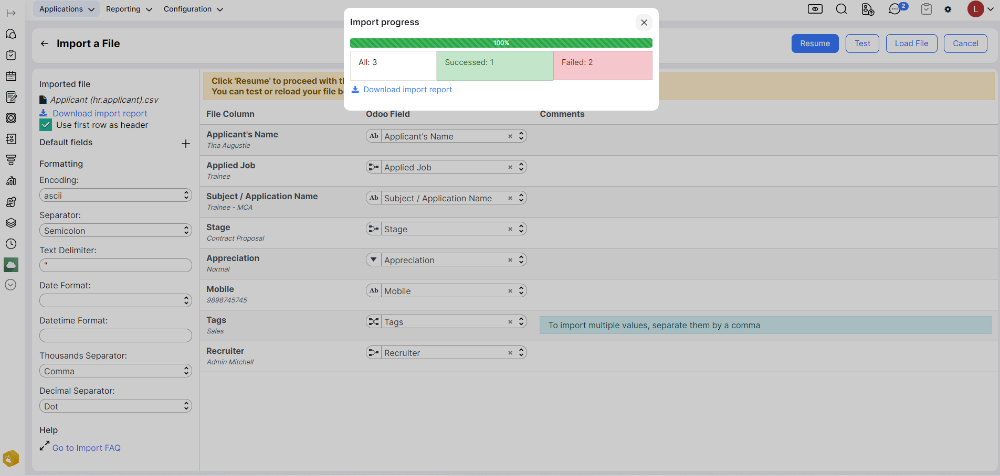

By downloading the file, you can analyze the import result in detail. The Status field allows you to set up a filter for errors and work on data quality. Info gives an understanding of the reason why the record was not created.

In our example, the record was not created since such a record already exists in the system, "Duplicate Rules" blocks the creation of duplicates.

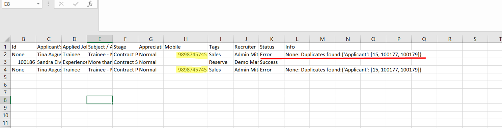

### Tips and useful features

- The set of fields in the table header corresponds to your List view settings and can be changed to suit your needs:
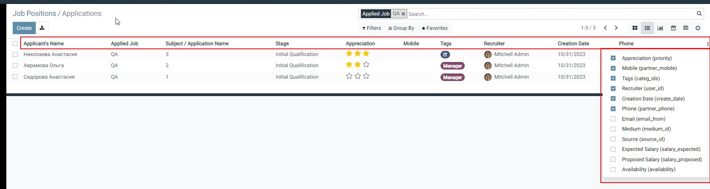

- By clicking on the name of the entry, you can go to it.
- Depending on the settings of the duplicate search rules, the system can show records from various objects:
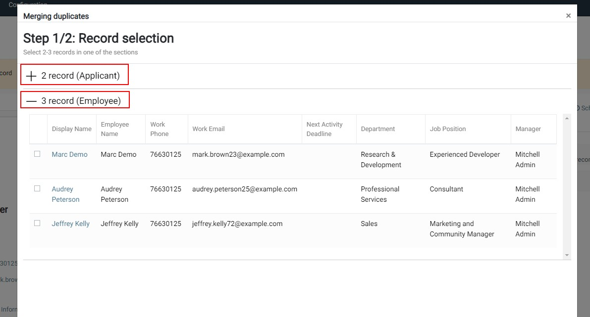

In this case, the first collection refers to the Applicant object; 2 duplicate records were found in it, and the second collection refers to Employee: 3 records were found that matched the applicants. You can only merge records from one object; the system will not allow you to mark such records at the same time.

- The Show only differences button allows you to focus on differences in records:
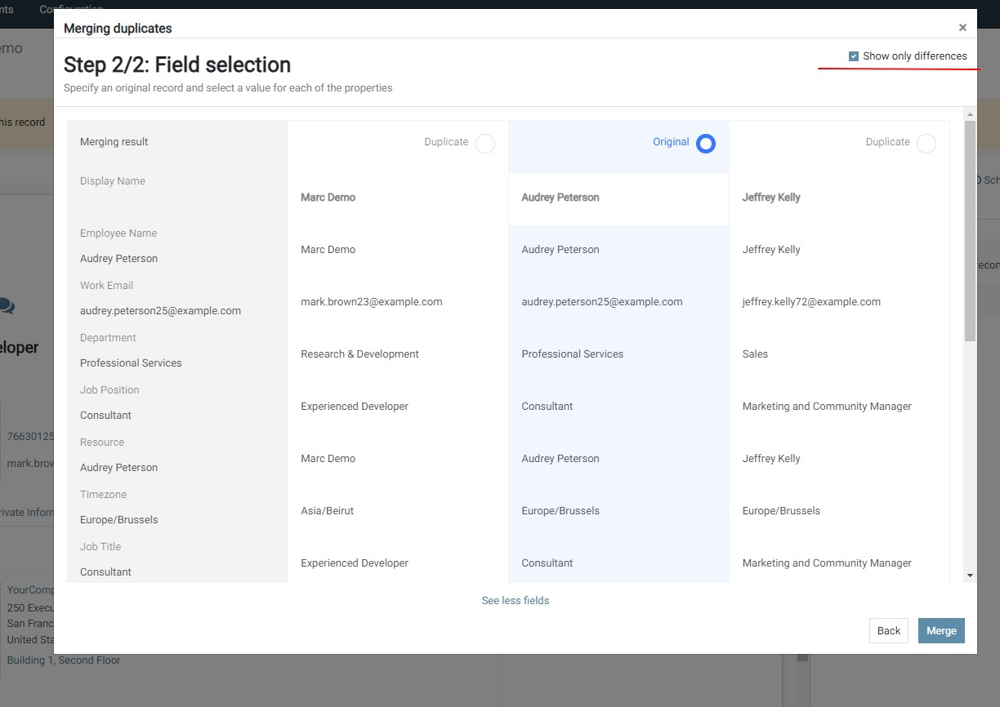